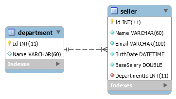

# CRUD Department and Seller

O principal objetivo do projeto foi praticar conceitos sobre JavaFx, JDBC, Orientação Objetos e expressões lambda.

- - - - 

## Começando ##
Para executar o projeto será necessário:
* [Java 8 ou superior para executar o projeto](https://www.oracle.com/java/technologies/javase-downloads.html)

  
Para editar o projeto são necessárias as bibliotecas:
* [JavaFx 11.0.2 ou superior](https://gluonhq.com/products/javafx/)
* [MySQL JDBC Connector (usei a versão 5.1.48)](https://dev.mysql.com/downloads/connector/j/)

**Dica**: No meu caso, eu criei uma User Library pras duas bibliotecas e então adicionei os .jar externos nela. Para fazer isso no Eclipse:

Window -> Preferences -> Java -> Build Path -> User Libraries -> e então criei uma com o nome "MySQL Connector" e adicionei os jars externos e uma outra com o nome "JavaFX".

### Banco de Dados MySQL ###
Script para a criação inicial da estrutura das tabelas (foram criadas no banco **coursejdbc**):

```
DROP TABLE IF EXISTS `department`;
CREATE TABLE `department` (
  `Id` int(11) NOT NULL AUTO_INCREMENT,
  `Name` varchar(60) DEFAULT NULL,
  PRIMARY KEY (`Id`)
) DEFAULT CHARSET=utf8mb4;

DROP TABLE IF EXISTS `seller`;
CREATE TABLE `seller` (
  `Id` int(11) NOT NULL AUTO_INCREMENT,
  `Name` varchar(60) NOT NULL,
  `Email` varchar(100) NOT NULL,
  `BirthDate` datetime NOT NULL,
  `BaseSalary` double NOT NULL,
  `DepartmentId` int(11) NOT NULL,
  PRIMARY KEY (`Id`),
  KEY `DepartmentId` (`DepartmentId`),
  CONSTRAINT
  `seller_ibfk_1` FOREIGN KEY (`DepartmentId`)
  REFERENCES `department` (`Id`)
) DEFAULT CHARSET=utf8mb4;
```
Diagrama do banco de dados:
 

Para ser possível rodar a aplicação e ela conseguir se conectar é necessário ter instalado o MySQL e alterar o **user**, **password** e o **dburl** contidos no arquivo **db.properties** de acordo com a sua máquina e suas configurações.


- - - - 

## Principais funcionalidades ##

* É possível cadastrar/editar/excluir departamentos e vendedores.
* É possível pesquisar por nome e filtrar por departamento os vendedores.

- - - -
 
 ## Vídeo da Interface ##
 
 https://youtu.be/g9L-pYQ3nnY
